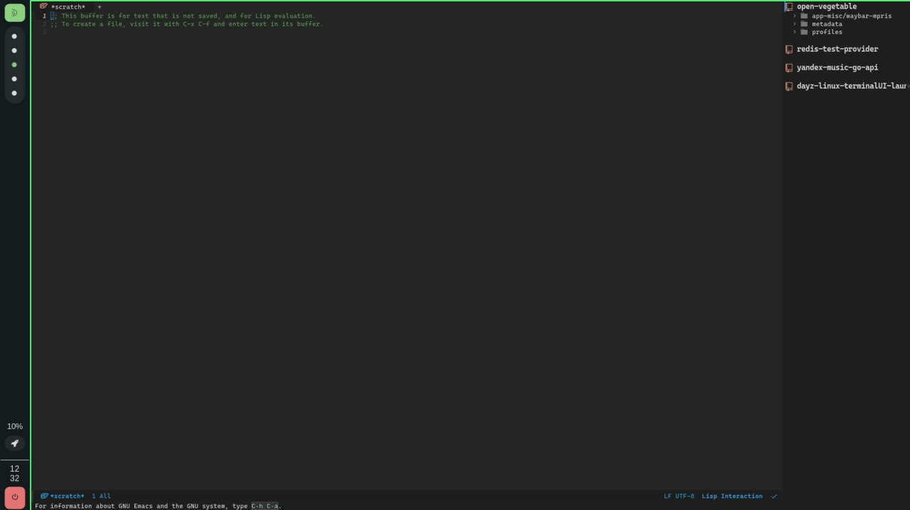

# Dotfiles
### I use ~~Arch~~ Gentoo btw.
## Config list:
|Utility:|Config:|
|--------|-------|
|[Alacritty](https://github.com/alacritty/alacritty)|[alacritty.yml](https://github.com/DrugsNotIncluded/dotfiles/blob/main/alacritty/.config/alacritty.yml)|
|[Emacs](https://www.gnu.org/software/emacs/)|[init.el](https://github.com/DrugsNotIncluded/dotfiles/blob/main/emacs/.emacs.d/init.el)|
|[mako](https://github.com/emersion/mako)|[config](https://github.com/DrugsNotIncluded/dotfiles/blob/main/mako/.config/mako/config)|
|[neovim](https://github.com/neovim/neovim)|[init.vim](https://github.com/DrugsNotIncluded/dotfiles/blob/main/nvim/.config/nvim/init.vim)|
|[pipewire](https://gitlab.freedesktop.org/pipewire/pipewire/)|[pipewire.conf & rtkit setup](https://github.com/DrugsNotIncluded/dotfiles/tree/main/pipewire/.config/pipewire)|
|[rofi-bluetooth](https://github.com/nickclyde/rofi-bluetooth)|[rofi-bluetooth](https://github.com/DrugsNotIncluded/dotfiles/blob/main/rofi-bluetooth/.local/bin/rofi-bluetooth)|
|[rofi](https://github.com/davatorium/rofi)|[config.rasi](https://github.com/DrugsNotIncluded/dotfiles/blob/main/rofi/.config/rofi/config.rasi)|
|[zsh](https://sourceforge.net/p/zsh/code/ci/master/tree/)|[.zshrc](https://github.com/DrugsNotIncluded/dotfiles/blob/main/shell/.zshrc)|
|[sway](https://github.com/swaywm/sway)|[config](https://github.com/DrugsNotIncluded/dotfiles/blob/main/sway/.config/sway/config)|
|[vifm](https://github.com/vifm/vifm)|[config & colorsheme](https://github.com/DrugsNotIncluded/dotfiles/tree/main/vifm/.config/vifm)|
|[waybar](https://github.com/Alexays/Waybar)|[config, colors and weather plugin](https://github.com/DrugsNotIncluded/dotfiles/tree/main/waybar/.config/waybar)|
|[wayfire](https://github.com/WayfireWM/wayfire)|[wayfire.ini](https://github.com/DrugsNotIncluded/dotfiles/blob/main/wayfire/.config/wayfire.ini)|
|[wireplumber](https://gitlab.freedesktop.org/pipewire/wireplumber)|[Whole config set](https://github.com/DrugsNotIncluded/dotfiles/tree/main/wireplumber/.config/wireplumber)|

# Installation:
Copy repo to home root , cd ~/dotfiles and run `stow <package>` for each directory in dotfiles. 
### Example:
`stow sway` will make symlink to ~/dotfiles/sway/.config/sway in ~/.config/sway
# Desktop:
